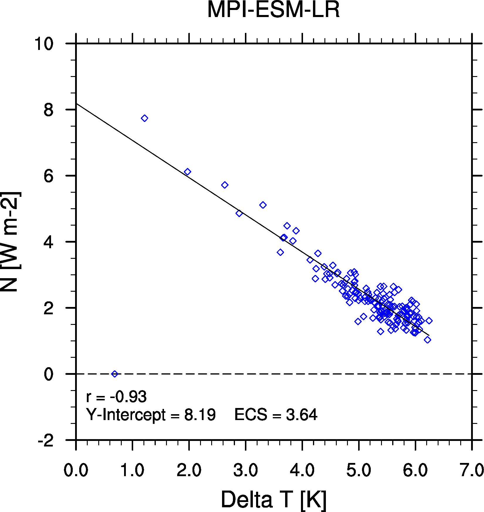

Equilibrium Climate Sensitivity (ECS) & Transcient Climate Response (TCR)
=========================================================================

Overview
--------

This namelist calculates the Equilibrium Climate Sensitivity (ECS) using
abrupt4xCO2 and piControl runs for the variables rtmt and tas. TCR values are computed in a second step considering all the missing values of ECS. So only models will be used which have an ECS value. To calculate the TCR the 1pctCO2 experiment is used. It is calculated taking the difference between the start of the experiment and a 20-year period centered on the time of CO\ :sub:`2`\ doubling.
In the following figure 9.42b of the IPCC AR5 (Flato et al., 2013) is plotted.

Available namelists and diagnostics
-----------------------------------

Namelists are stored in nml/

* namelist_ECS.xml

Diagnostics are stored in diag_scripts/

* ECS.ncl
* TCR.ncl

User settings
-------------

User setting files (cfg files) are stored in nml/cfg_TCR/

#. ECS.ncl: cfg_ECS_anomaly.ncl

   *Required diag_script_info attributes*

   None.

   *Optional diag_scipt_info attributes*

   * ts_minlat (default = -90)
   * ts_maxlat (default = 90)
   * ts_minlon (default = 0)
   * ts_maxlon (default = 360)
   * time_avg: "yearly" (no other values supported yet)

   *Required variable_info attributes*

   None.

#. TCR.ncl: cfg_TCR.ncl

   *Required diag_script_info attributes*

   None.

   *Optional diag_scipt_info attributes*

   * calcmm:     False (default) = do not calculate multimodel mean;
                 True = calculate multimodel mean
   * ecs_file:   path relative to ESMValTool work_dir + file name of
                 netCDF containing precalculated ECS values;
                 default: "ECS/ECS.nc"
   * styleset:   "CMIP5" (if not set, a color table and symbols for
                 plotting will be created)
   * legend_outside: True, False

   *Required variable_info attributes*

   None.

Variables
---------

* tas (abrupt4xCO2 & piControl & 1pctCO2, monthly mean, longitude, latitude, time)
* rtmt (abrupt4xCO2 & piControl & 1pctCO2, monthly mean, longitude, latitude, time)

Observations and reformat scripts
---------------------------------

None.

References
----------

* Andrews et al., 2012, Forcing, feedbacks and climate sensitivity in CMIP5 coupled atmosphere-ocean climate models, Geophys. Res. Lett., 39, doi: 10.1029/2012GL051607.

* Flato, G., J. Marotzke, B. Abiodun, P. Braconnot, S.C. Chou, W. Collins, P. Cox, F. Driouech, S. Emori, V. Eyring, C. Forest, P. Gleckler, E. Guilyardi, C. Jakob, V. Kattsov, C. Reason and M. Rummukainen, 2013: Evaluation of Climate Models. In: Climate Change 2013: The Physical Science Basis. Contribution of Working Group I to the Fifth Assessment Report of the Intergovernmental Panel on Climate Change [Stocker, T.F., D. Qin, G.-K. Plattner, M. Tignor, S.K. Allen, J. Boschung, A. Nauels, Y. Xia, V. Bex and P.M. Midgley (eds.)]. Cambridge University Press, Cambridge, United Kingdom and New York, NY, USA.

Example plots
-------------

.. _fig_ecs:

   Created with ECS.ncl.

.. _fig_tcr:

   Created with TCR.ncl, similar to Flato et al. (2013), Fig. 9.42b.

