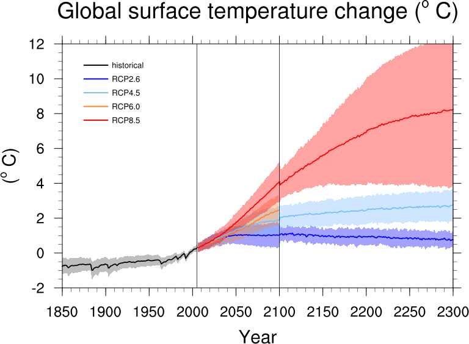
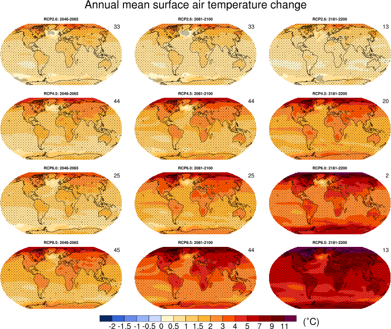
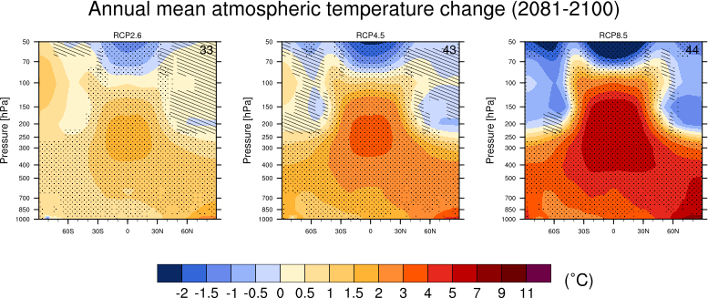
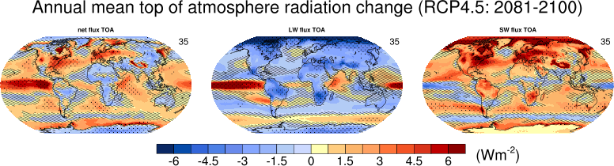

IPCC AR5 Chapter 12
===================

Overview
--------

The goal of this effort is to code up routines to reproduce Chapter 12 of AR5 (Collins et al., 2013), so that the plots can be readily reproduced for ScenarioMIP simulations and compared to previous CMIP versions.

Available namelists and diagnostics
-----------------------------------

Namelists are stored in nml/

* namelist_collins13ipcc.xml

Diagnostics are stored in diag_scripts/

* calc_map_diff_scaleT_mmm_stipp_ipcc12.ncl
* IAV_for_stippandhatch_ipcc12.ncl
* IAV_mmm_for_stippandhatch_ipcc12.ncl
* map_diff_each_model_ipcc12.ncl
* map_diff_mmm_stippandhatch_ipcc12.ncl
* plot_map_diff_mmm_stipp_ipcc12.ncl
* plot_ts_line_collins_ipcc_ch12.ncl
* plot_zonal_cont_diff_mmm_stippandhatch_ipcc12.ncl
* snw_area_seas_ipcc1232.ncl
* ts_line_collins_ipcc_ch12.ncl
* zonal_cont_diff_mmm_stippandhatch_ipcc12.ncl

The main plot type which can be reproduced are maps of multi-model mean changes for annual or seasonal means over different scenarios and time periods with stippling and hatching indicating where the change is greater than two standard deviations of internal variability and where at least 90% of models agree on the sign of the change (map_diff_mmm_stippandhatch_ipcc12.ncl and plot_map_diff_mmm_stipp_ipcc12.ncl). For the stippling to work the internal variability needs to be calculated from the piControl runs before the plotting using diagnostics IAV_for_stippandhatch_ipcc12.ncl (calculates and stores it for each individual model) or IAV_mmm_stippandhatch_ipcc12.ncl (calculates the multi-model mean variability for all given models). Either a multi-model mean based on whatever runs were included in IAV_mmm_stippandhatch_ipcc12.ncl can be used or the individual variabilities for the same models plotted can be used (in this case the mult-model mean is calculated in map_diff_mmm_stippandhatch_ipcc12.ncl using the corresponding models only). The optional diag_script_info attribute diag_script_info@iavmode (set to "each" for the latter) determines this behaviour, default if not given is that pre-calculated mult-model mean is used.

Very similar to above are the routines for zonal plots of 3D variables, zonal_cont_diff_mmm_stippandhatch_ipcc12.ncl and plot_zonal_cont_diff_mmm_stippandhatch_ipcc12.ncl. Again, for the stippling and hatching to work the internal variability needs to be precalculated using IAV_mmm_stippandhatch_ipcc12.ncl or IAV_for_stippandhatch_ipcc12.ncl. Very long control runs for high resolution can cause memory problems (e.g. MPI-ESM-MR 1000 year piControl, check available memory on your machine). In addition, this routine allows to plot a baseline field in contourlines (as e.g. in Figure 12.19 for wind).

Results from individual models can be plotted with map_diff_each_model_ipcc12.ncl (Figure 12.9).

Global (or regional) average timeseries (as e.g. Figure 12.5) can be calculated and plotted with ts_line_collins_ipcc_ch12.ncl and plot_ts_line_collins_ipcc_ch12.ncl.

Changes relative to global temperature change can be calculated with calc_map_diff_scaleT_mmm_stipp_ipcc12.ncl. Here significance is determined where mean change averaged over all realizations is larger than the 95% percentile of the distribution of models (as in Figure 12.10). plot_map_diff_mmm_stipp_ipcc12.ncl can also be used to plot these figures.

snw_area_seas_ipcc1232.ncl is used to calculate snow area extent changes. For this we need sftgif and sftlf from each included model. Either snw_area can be derived by using variable_defs/snw_area.ncl, in this case the variable in the namelist is snw_area and sftgif and sftlf need to be provided in the same folder structure as the other files (MIP = fx, ensemble = r0i0i0), or variable_defs/snw_area.ncl needs to be adapted accordingly. Alternatively snw can be used as variable in the namelist and then snow area is calculated within snw_area_seas_ipcc1232.ncl. In that case ESMValTool needs to be tricked into providing sftgif and sftlf as reformatted files in /work/climo, e.g. by calling MyDiag.ncl. The plotting can be done using plot_ts_line_collins_ipcc_ch12.ncl.

The following figures from Collins et al. (2013) are included:

* Figure 12.05: Time series of global annual mean surface air temperature anomalies (relative to 1986-2005) from concentration driven experiments.
* Figure 12.09: Surface air temperature change 2081-2100 as anomalies with respect 1986-2005 for RCP4.5 from one ensemble of each model in archive.
* Figure 12.10: Surface air temperature and precipitation change scaled by global mean temperature change (temperature and precipitation need to be processed and plotted separately).
* Figure 12.11: Surface temperature change for RCP2.6, 4.5, 6.0, 8.5 for multi-model mean, 2046-2065, 2081-2100 and 2181-2200 relative to 1986-2005 (significance indicated by stippling and hatching)
* Figure 12.12: Annual mean zonal mean multi-model atmospheric and ocean temperature changes 2081-2100 relative to 1986-2005 (significance indicated by stippling and hatching). tas and thethao need to be processed and plotted separately.
* Figure 12.15: Global top of the atmosphere energy flux (net flux, LW flux and SW flux) timeseries for historical period and all RCPs 1850-2100. Multi-model mean and 1.64 std ensemble spread.
* Figure 12.16: Annual mean top of atmosphere radiation change (RCP4.5: 2081-2100) with respect to 1900-1950. Multi-model average change of net total TOA radiation anomaly, net LW TOA radiation anomaly and net SW TOA radiation anomaly (significance indicated by stippling and hatching).
* Figure 12.17: Annual mean cloud fraction change for RCPs 2.6, 4.5, and 8.5 2081-2100. Multi-model average change relative to 1986-2005 for 2081-2100 (significance indicated by stippling and hatching).
* Figure 12.18: Seasonal mean sea level pressure change for RCPs 2.6, 4.5, and 8.5 2081-2100. Multi-model average change with respect to 1986-2005 for 2081-2100 (significance indicated by stippling and hatching).
* Figure 12.19: Annual mean zonal mean multi-model wind changes 2081-2100 relative to 1986-2005 (significance indicated by stippling/hatching).
* Figure 12.21: Seasonal and annual mean relative humidity change for RCP8.5. Multi-model average change for 2046-2065 and 2081-2100 relative to 1986-2005 in DJF, JJA and ANN (significance indicated by stippling and hatching).
* Figure 12.22: Seasonal mean (percentage) precipitation change for RCP8.5. Multi-model average change for 2046-2065, 2081-2100 and 2180-2200 relative to 1986-2005 in DJF, MAM, JJA and SON (significance indicated by stippling and hatching).
* Figure 12.23: Annual mean soil moisture change for RCP2.6, 4.5, 6.0, 8.5 for multi-model mean, 2081-2100 relative to 1986-2005 (significance indicated by stippling and hatching).
* Figure 12.24: Annual mean runoff change for RCP2.6, 4.5, 6.0, 8.5 for multi-model mean, 2081-2100 relative to 1986-2005 (significance indicated by stippling and hatching).
* Figure 12.25: Annual mean evaporation change for RCP2.6, 4.5, 6.0, 8.5 for multi-model mean, 2081-2100 relative to 1986-2005 (significance indicated by stippling and hatching).
* Figure 12.32: Snow cover extend change in the Northern Hemisphere (Area can be specified in cfg_* file).
* Figure 12.34: Annual mean sea surface salinity change for RCP8.5 for multi-model mean, 2081-2100 relative to 1986-2005 (significance indicated by stippling and hatching).

User settings
-------------

Configuration files are stored in nml/cfg_collins13ipcc/

**Warning:** IAV_mmm_stippandhatch_ipcc12.ncl and IAV_for_stippandhatch_ipcc12.ncl need a lot of memory for 3D variables (e.g. thetao). If diag_script_info@periodlength is used more than 100 years (+ periodlength) of data are needed as the first 100 years are discarded (to avoid possible drifts at the beginning of the runs). If you run out of memory, try deleting diag_script_info@periodlength in the corresponding configuration file and use a shorter piControl time period in the namelist. Then IAV is simply calculated over the whole time period given from the namelist.

Variables
---------

* tas (atmos, monthly mean, longitude, latitude, time)
* ta (atmos, monthly mean, longitude, latitude, pressure levels, time)
* thetao (ocean, monthly mean, longitude, latitude, depth levels, time)
* rtmt (atmos, monthly mean, longitude, latitude, time)
* rlut (atmos, monthly mean, longitude, latitude, time)
* rsut (atmos, monthly mean, longitude, latitude, time)
* clt (atmos, monthly mean, longitude, latitude, time)
* psl (atmos, monthly mean, longitude, latitude, time)
* ua (atmos, monthly mean, longitude, latitude, pressure levels, time)
* hurs (atmos, monthly mean, longitude, latitude, time)
* pr (atmos, monthly mean, longitude, latitude, time)
* mrsos (land, monthly mean, longitude, latitude, time)
* mrro (land, monthly mean, longitude, latitude, time)
* evspsbl (atmos, monthly mean, longitude, latitude, time)
* sos (ocean, monthly mean, longitude, latitude, time)
* snw (landice, monthly mean, longitude, latitude, time)

Observations and reformat scripts
---------------------------------

* None

References
----------

* Collins, M., R. Knutti, J. Arblaster, J.-L. Dufresne, T. Fichefet, P. Friedlingstein, X. Gao, W.J. Gutowski, T. Johns, G. Krinner, M. Shongwe, C. Tebaldi, A.J. Weaver, and Wehner, M.: Long-term Climate Change: Projections, Commitments and Irreversibility. In: Climate Change 2013: The Physical Science Basis. Contribution of Working Group I to the Fifth Assessment Report of the Intergovernmental Panel on Climate Change, Stocker, T. F., D. Qin, G.-K. Plattner, M. Tignor, S.K. Allen, J. Boschung, A. Nauels, Y. Xia, V. Bex and P.M. Midgley (Ed.), Cambridge University Press, Cambridge, United Kingdom and New York, NY, USA, 2013.

Example plots
-------------

   Resembling Collins et al. (2013), Fig. 12.5.

   Resembling Collins et al. (2013), Fig. 12.11.

   Resembling Collins et al. (2013), Fig. 12.12a.

   Resembling Collins et al. (2013), Fig. 12.16.

