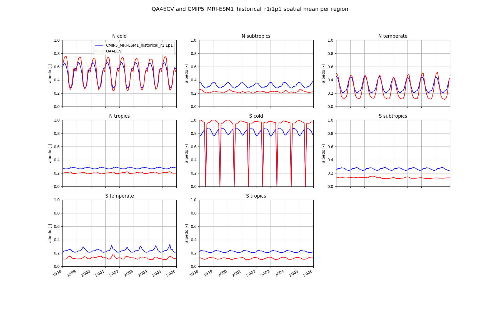
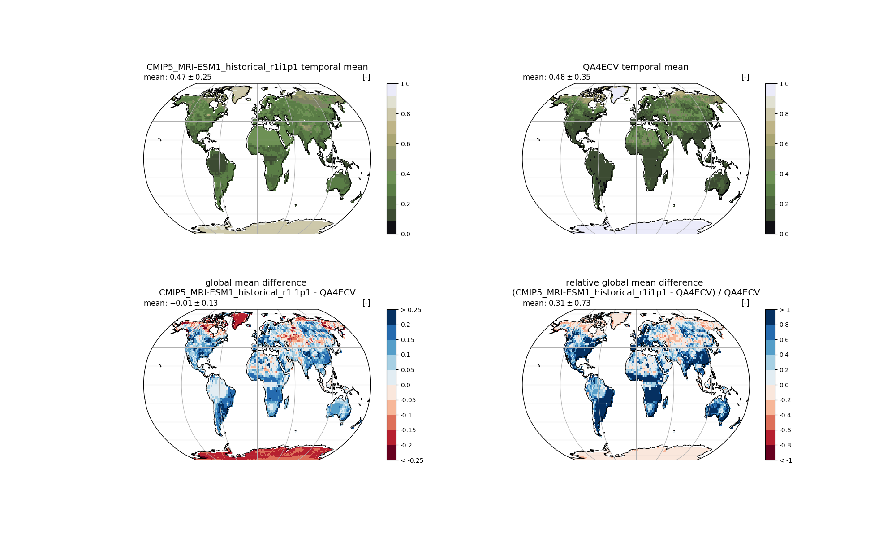

DIAGNOSTIC OF EXTREME CLIMATE EVENTS
====================================

   Regionalized time series of spatial mean for CMIP5_MRI-ESM1_historical_r1i1p1 and QA4ECV albedo.

   Global mean time series for CMIP5_MRI-ESM1_historical_r1i1p1 and QA4ECV albedo (upper row). Additionally, differences are shown in the lower row, both in absolute values (left) and relative to the QA4ECV data set (right).
